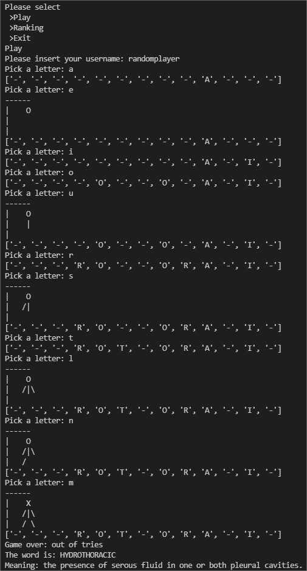

# Hangman.py
# Game of Hangman
> A game of hangman made with Python.

## Table of Contents
<!--* [General Info](#general-information)-->
* [Technologies Used](#technologies-used)
* [Features](#features)
* [Screenshots](#screenshots)
* [Setup](#setup)
* [Usage](#usage)
* [Project Status](#project-status)
* [Room for Improvement](#room-for-improvement)
* [Acknowledgements](#acknowledgements)
<!--* [Contact](#contact)-->
<!-- * [License](#license) -->

<!--## General Information
- 
<!-- You don't have to answer all the questions - just the ones relevant to your project. -->

## Technologies Used
- Python
- Postgre

## Features
- Main menu: the player can choose between the options "Play", show "Ranking", "Exit" the game 
- Random word: the word to be guessed is randomly picked from a list of over 260k words
- Drawing the hanged man: the code draws the man as the player makes wrong guesses
- Storing the result: the result of each game is stored in a database via Postgre
- Ranking: the player can fetch the ranking from the database in the main menu

## Screenshots

<!-- If you have screenshots you'd like to share, include them here. -->

## Setup
You must place the following files in the same folder:
- Hangman.py (the main code of the game)
- sowpods.txt (a list of words used in the game)
- Hangman.db (the database used to store the game results)
- Game_clss.py (a class used to assist the storage in hangman.db)

## Usage
Simply fire up your IDE and follow the steps on the screen

## Project Status
Project is: _in progress_

## Room for Improvement
Include areas you believe need improvement / could be improved. Also add TODOs for future development.

Room for improvement:
- Implement a GUI with tkinter
- Implement a hint system for the player

To do:
- 

## Acknowledgements
- This project was based on an exercise from https://www.practicepython.org/ where I expanded upon, adding new features. 

<!-- Optional -->
<!-- ## License -->
<!-- This project is open source and available under the [... License](). -->

<!-- You don't have to include all sections - just the one's relevant to your project -->
